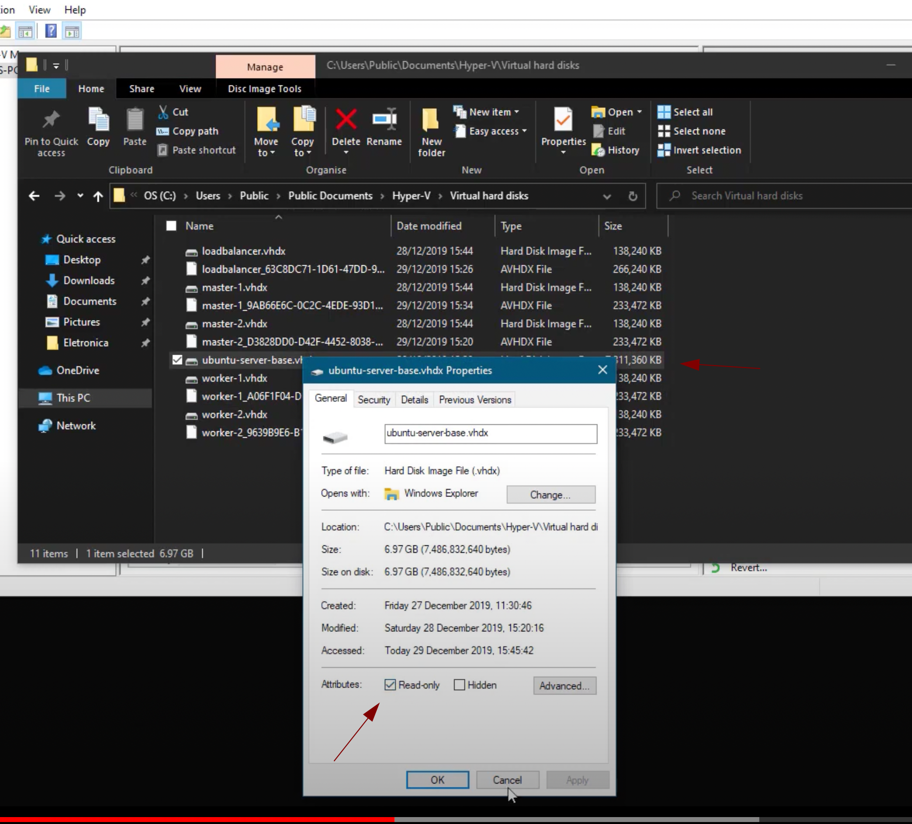

# Ambiente Windows

## Usando o hyper-v (com econômia de espaço)


1) Criar uma máquina virtual com a instalação zerada
2) Depois de criar a máquina que será base para as próximas vamos deixar o HD dela como read-only e podemos apagar essa máquina. Nos próximos passos vamos usar esse HD para criar novas máquinas sendo apenas diferencias da máquina base



3) Para criar um HD diferencial, basta clicar em new > hd > next > VHDX > Differencing > Informar nome e localização > selecionar o hd pai (hd do passo 2)
4) Criar uma VM com o novo HD diferencial basta clicar em new > next > nome da vm > next > generetion 1 > connect a virtual disk, selecionar o hd criado no passo 3 > finish
5) Criar as seguintes máquinas. 
* 2 Master
* 2 Workes
* 1 Load balance


https://www.youtube.com/watch?v=ug1c-F-wpuE


## Configurando a rede do tipo bridge

Passo 1: Configurar o novo adpador
```
Actions > Virtual Switch Manager > New virtual network switch > External

Name: Bridge
External Network: Selecionar a placa de rede
Allow management operating system to share this network adapter : true
```

Passo 2: Vincular o adaptador a máquina virtual
```
Na máquina virtual > Configurações > Network Adapter > selecionar o adaptador criado acima
```